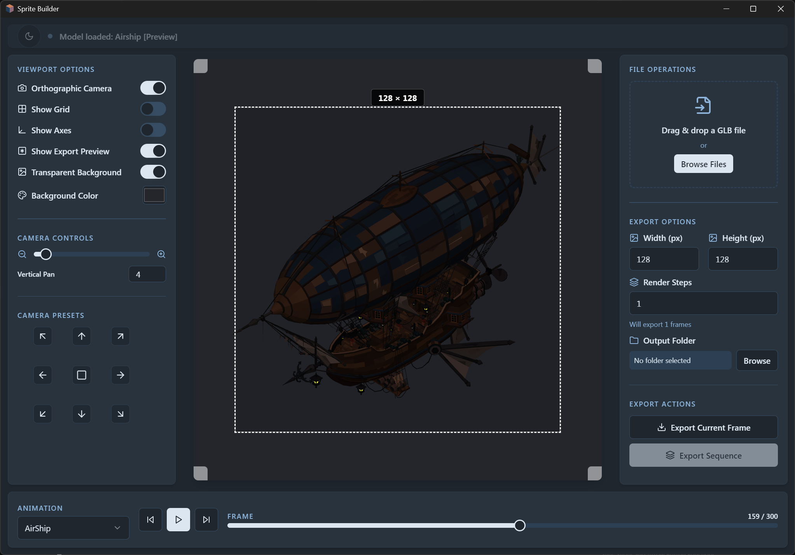

# Sprite Builder

*easy image export from 3D assets*

visit https://bukkbeek.itch.io/sprite-builder to preview/ download compiled windows version

A desktop application for converting 3D GLB models into sprite sheets and animated sequences. Designed for game developers, animators, and 3D artists who need to create high-quality 2D sprite assets from 3D models.

- **Easy pixel art from anmated 3D models**
- **Icon generation from 3D models**




## Overview

Sprite Builder simplifies the process of creating 2D sprites from 3D models, enabling seamless integration of 3D assets into 2D game environments and applications.

## Key Features

- **3D model import (.glb)**
- **Animation sequences**
- **Batch export**
- **Real time effects**


## Installation

### Prerequisites

- [Node.js](https://nodejs.org/) (v16 or higher)

### Install (Windows/ MacOS/ Linux)

```bash
# Install dependencies
npm install

# Start the application in development mode
npm start

# Build and package the application
npm run package
```

The packaged application will be available in the `release` folder


## Quick Start Guide

1. **Import a GLB Model**:
   - Drag and drop a GLB file into the application or use the "Browse Files" button
   - The model will be loaded and displayed in the viewport

2. **Adjust Camera Settings**:
   - Use the left panel to adjust camera position, angle, and zoom
   - Toggle between orthographic and perspective views
   - Use preset camera positions or manually adjust the camera

3. **Configure Export Settings**:
   - Set the desired width and height for your sprites
   - Choose between transparent or colored background
   - Set the number of render steps for animations
   - Select an output folder for batch exports

4. **Export Your Sprites**:
   - Export the current frame as a single sprite
   - Export an entire animation sequence as multiple sprites
   - Preview your export in real-time

5. **Animation Controls**:
   - Select animations from the dropdown in the bottom panel
   - Play, pause, and scrub through animations
   - Set the current frame for precise positioning

## Development

```bash
# Install dependencies
npm install

# Start the development server
npm start

# Build the application
npm run build

# Build the Electron part
npm run build:electron

# Package the application for distribution
npm run package
```

## Technology Stack

- **React**: UI framework
- **Three.js**: 3D rendering
- **Electron**: Desktop application framework
- **TypeScript**: Type-safe JavaScript
- **Tailwind CSS**: Styling
- **shadcn/ui**: UI components


## Acknowledgements

- [Lovable](https://lovable.dev) - For drafting the initial application structure and design
- [Cursor](https://cursor.sh) - The AI-powered code editor used for development
- [Claude 3.7 Sonnet](https://anthropic.com/claude) - AI assistant


© bukkbeek | CeylonBlocks